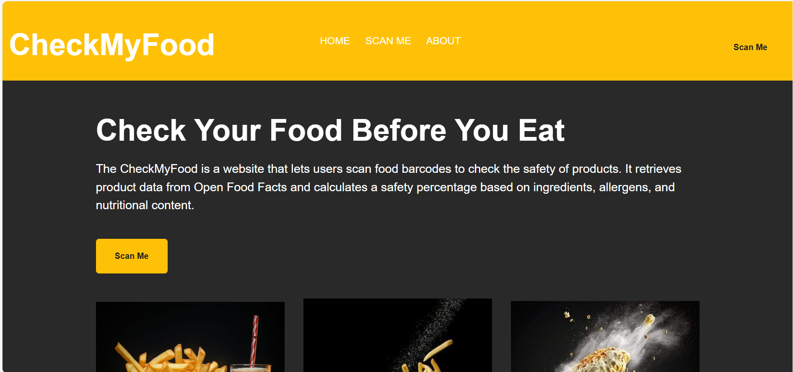
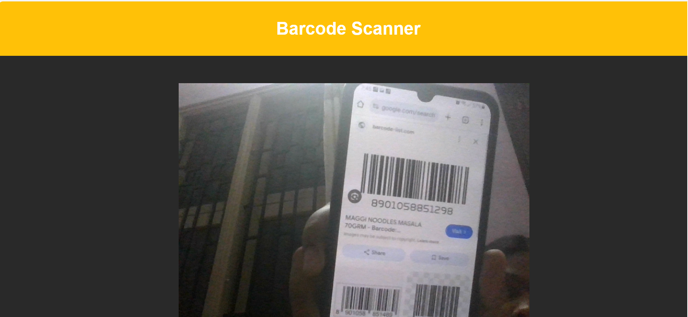
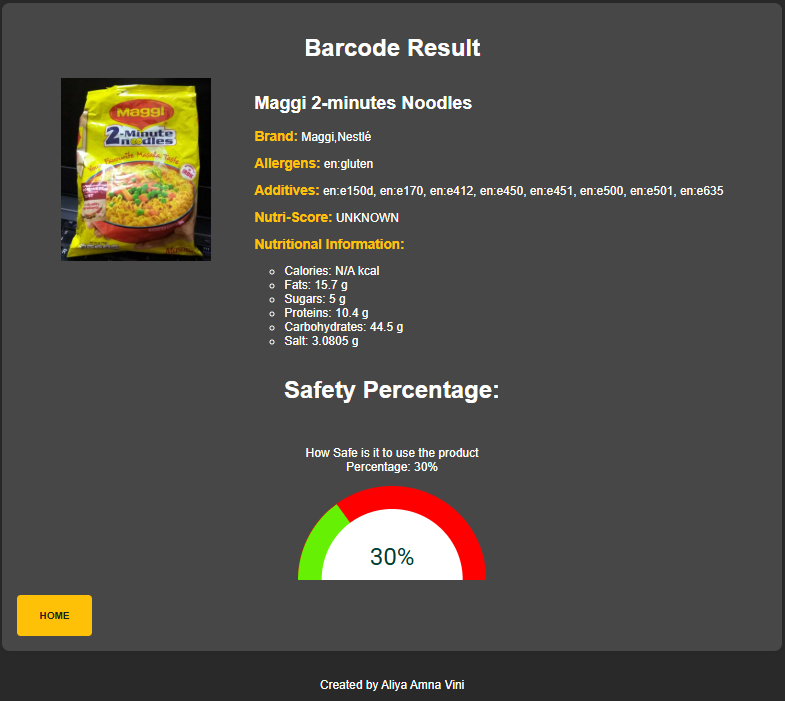

# 🍽️ CheckMyFood

**CheckMyFood** is a web-based food barcode scanner that helps users verify the **safety of packaged food items** before consumption. By scanning a barcode, it fetches real-time product data from the **Open Food Facts API** and displays essential information such as allergens, additives, nutritional content, and a calculated **Safety Percentage** using a visual gauge.

---

## 📌 Project Overview

CheckMyFood is built to raise awareness about what we consume. It simplifies food evaluation by allowing users to scan product barcodes and instantly access key health-related details, helping them make better dietary decisions.

---

## 🌟 Features

- 📷 **Barcode Scanner** using your device camera  
- 🌐 Real-time product data fetched from **Open Food Facts API**
- 🧾 Displays detailed food insights:
  - ✅ Brand Name  
  - ⚠️ Allergens  
  - ⚠️ Additives  
  - 🍽️ Nutritional Breakdown  
  - 🧠 Nutri-score (if available)
- 🎯 Calculates and shows a **Safety Percentage** using a color-coded visual gauge
- 📱 **Responsive design** for mobile, tablet, and desktop devices

---

## 🎥 How It Works

📽️ A quick demo video is available in the project folder.  
📂 Navigate to: `media/How it works.mp4` to see how the application functions.


---

## 🖼️ Screenshots

### 🔹 Home Page  


---

### 🔹 Barcode Scanner  


---

### 🔹 Product Result  


---

## 🛠️ Technologies Used

- **HTML**
- **CSS**
- **JavaScript**
- **Chart.js** – for rendering the safety gauge
- **Open Food Facts API** – to retrieve product details

---

## 🚀 How to Run

1. Clone the repository:
   ```bash
   git clone https://github.com/yourusername/CheckMyFood.git
2. Open index.html in your browser (recommended: use Live Server)

3. Click on “Scan Me”, allow camera access, and scan a barcode

Works best in secure browsers (e.g., Chrome) with HTTPS or localhost

📄 License
This project is licensed under the MIT License

